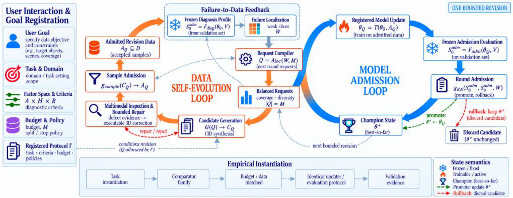
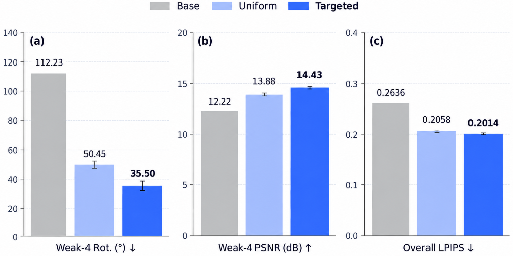
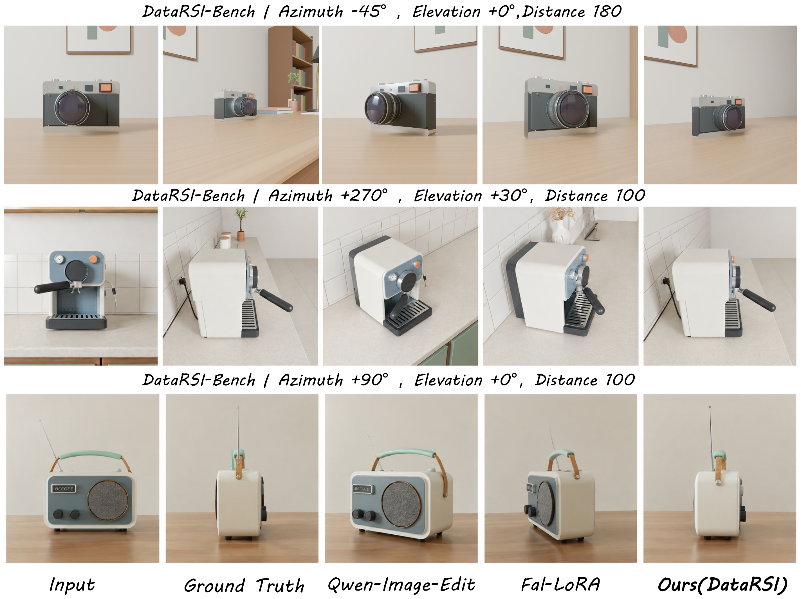

# DataRSI
## A 3D Data Harness for Failure-to-Data Evolution

Official implementation and experimental artifacts for the ICASSP 2027 paper.

**Authors**: Qisong Zhang$^{1,*}$, Wenzhuo Wu$^{1,*}$, Zhuangzhuang Jia$^1$, Yunhao Yang$^1$, Shuo Zhang$^1$, Huayu Zhang$^2$, Xianghao Zang$^2$, Zhixiang He$^2$, Zhongjiang He$^{2,\dagger}$, Kongming Liang$^{1,\ddagger}$, Zhanyu Ma$^1$  
$^{1}$School of Artificial Intelligence, Beijing University of Posts and Telecommunications (BUPT)  
$^{2}$Institute of Artificial Intelligence (TeleAI), China Telecom  
$^{*}$Equal contribution. $^{\dagger}$Project lead. $^{\ddagger}$Corresponding author.

[](https://pris-cv.github.io/DataRSI/)
[](https://github.com/PRIS-CV/DataRSI)
[](LICENSE)

---

### DataRSI and DataEvolver

DataRSI is the research framework introduced in our ICASSP 2027 work. It builds on the synthetic-data construction infrastructure developed in [DataEvolver](https://github.com/PRIS-CV/DataEvolver) and formalizes failure-driven dataset evolution as an auditable bounded revision process.

For details on the technical and institutional distinctions, see [docs/DATAEVOLVER_RELATION.md](docs/DATAEVOLVER_RELATION.md).

---

### 30-Second Reviewer Quick Index

Reviewers can verify all paper contributions and empirical claims immediately:

| Reviewer Question | Answer & Location | Quick Verification |
|---|---|---|
| **1. What is DataRSI?** | A 3D data harness formalizing synthetic supervision as an explicit revision state. | See [Method Overview](#method-overview) |
| **2. Relation to DataEvolver?** | Builds on DataEvolver's 3D infrastructure; studies bounded failure-to-data revision protocols. | [docs/DATAEVOLVER_RELATION.md](docs/DATAEVOLVER_RELATION.md) |
| **3. Where are Figure 1 modules?** | Mapped cleanly to `datarsi/` subpackages. | [Figure 1 & Code Map](#figure-1-harness-architecture) |
| **4. How to reproduce Table 3?** | Matched-budget 72-request comparison across seeds 42, 43, 44. | `python scripts/reproduce_tables.py` |
| **5. Where are 3-seed raw results?** | Complete paired metric contrasts stored in `artifacts/icassp2027/`. | [artifacts/icassp2027/](artifacts/icassp2027/) |
| **6. Where is the sample repair audit?** | 72 candidates audited on matching registered coordinates (2 recovered). | [docs/REPAIR_AUDIT.md](docs/REPAIR_AUDIT.md) |
| **7. Why 3/3 PROMOTE verdicts?** | All 3 seeds satisfy Weak-4 reduction $>5\%$ and canonical redline $<5.0^\circ$. | `python scripts/reproduce_admission.py` |
| **8. Historical vs. Controlled?** | Table 1(a) is historical feasibility; Table 3 is the core controlled study. | [Experimental Results](#experimental-results) |

---

## Figure 1: Harness Architecture

<p align="center">
  
</p>

> *DataRSI couples a generation-time Data Self-Evolution Loop with a post-training Model Admission Loop through an explicit Failure-to-Data Feedback interface.*

```
Frozen Champion (theta_0)
      ↓
Failure Diagnosis (VGGT over structured factor space)
      ↓
Weak-Slice Localization (Weak-4 cells W)
      ↓
Executable 3D Requests (Q = Alloc(W, M), M=72)
      ↓
Generate → Inspect (VLM) → Bounded Repair (<=2 rds) → Deterministic Sample Contract (g_sample)
      ↓
Candidate Training (rank-32 LoRA, theta_Q)
      ↓
Frozen Validation (OriAnyV2 on development split)
      ↓
Regression-Aware Verdict: PROMOTE / ROLLBACK (g_RA)
```

---

## Method Overview

DataRSI establishes three methodological contributions for synthetic supervision:

### 1. Data Revision Abstraction
Synthetic supervision is treated as an explicit, protocol-frozen revision state. Each bounded revision transaction freezes the protocol $\Gamma = (\mathcal{D}, \mathcal{P}, M, \mathcal{G}, \mathcal{F}_{\mathrm{diag}}, g_{\mathrm{sample}}, \mathcal{T}, \mathcal{F}_{\mathrm{adm}}, g_{\mathrm{RA}})$ and starts from a frozen champion $\theta_0$, ensuring reproducible, auditable dataset evolution.

### 2. Failure-to-Data Interface
Instead of reweighting or filtering static datasets, frozen model failures over a structured factor space ($\mathcal{A} \times \mathcal{H} \times \mathcal{R}$) are diagnosed, localized into weak slices $W$, and directly compiled into registered executable 3D synthesis requests $Q$ that materialize new supervision in a controllable 3D environment.

### 3. Two-Level Revision Control
- **Sample-Level Admission ($g_{\mathrm{sample}}$)**: Multimodal inspection identifies eligible defects for bounded environment repair ($\le 2$ rounds) before a deterministic geometric contract admits samples into candidate training.
- **Model-Level Admission ($g_{\mathrm{RA}}$)**: Candidate model updates must satisfy frozen utility gains and regression guards (including a canonical-view hard redline) before replacing the champion.

> *Note: Qwen-Image-Edit, Blender, VGGT, OriAnyV2, and LoRA serve as registered component instantiations on our empirical testbed rather than standalone algorithmic claims.*

---

## Experimental Results

### A. Core Controlled Experiment: Uniform-72 vs. Targeted-72 (Table 3)

The central controlled study evaluates failure-directed allocation against uniform allocation under an identical **matched budget of 72 synthesis requests** ($M=72$) across three random training seeds (42, 43, 44):

<p align="center">
  
</p>

| Metric | Base | Uniform-72 | Targeted-72 | Targeted vs. Uniform Delta |
|---|:---:|:---:|:---:|:---:|
| **Weak-4 Rotation Error ($^\circ$) $\downarrow$** | 112.23 | $50.45 \pm 2.15$ | $\mathbf{35.50 \pm 3.23}$ | $\mathbf{-14.950 \pm 1.097^\circ}$ (wins 3/3 seeds) |
| **Weak-4 PSNR (dB) $\uparrow$** | 12.22 | $13.88 \pm 0.07$ | $\mathbf{14.43 \pm 0.09}$ | $\mathbf{+0.543 \pm 0.023\text{ dB}}$ |
| **Overall LPIPS $\downarrow$** | 0.2636 | $0.2058 \pm 0.0028$ | $\mathbf{0.2014 \pm 0.0030}$ | $\mathbf{-0.0044 \pm 0.0003}$ |

**Paired differences across seeds (Weak-4 rotation error)**:
- **seed42**: $-13.790^\circ$
- **seed43**: $-15.970^\circ$
- **seed44**: $-15.090^\circ$
- **Mean paired reduction**: $\mathbf{-14.950 \pm 1.097^\circ}$ ($<0$ in 3/3 seeds)
- **Non-weak rotation trade-off**: $+2.370 \pm 0.046^\circ$ (substantially outperforms Base: $34.64^\circ$ vs. $64.13^\circ$)
- **Overall rotation change**: $+0.205 \pm 0.125^\circ$

Reproduce in 1 second:
```bash
python scripts/reproduce_tables.py
```

---

### B. Task Adaptation Feasibility: Historical Checkpoints (Table 1a)

Evaluated on DataRSI-Bench ($N=384, 512^2$) to verify task adaptation feasibility:

<p align="center">
  
</p>

| Model Checkpoint | Description | PSNR (dB) $\uparrow$ | SSIM $\uparrow$ | LPIPS $\downarrow$ | FID $\downarrow$ | Acc@$45^\circ$ (\%) $\uparrow$ |
|---|---|:---:|:---:|:---:|:---:|:---:|
| **Base** | Qwen-Image-Edit-2511 | 12.82 | 0.6679 | 0.5595 | 95.88 | 12.50% |
| **fal (ref.)** | External reference LoRA | 12.93 | 0.6804 | 0.5597 | 93.05 | 22.40% |
| **Data-Evolved** | Recipe-driven supervision (420 pairs) | 13.29 | 0.6813 | 0.5303 | 89.41 | 22.92% |
| **Historical DataRSI** | First-pass revision (96 poses, rank-32) | **14.36** | **0.7223** | **0.5058** | **89.19** | **33.33%** |

> *Note: This table establishes adaptation feasibility across model configurations and is not a matched-budget comparison.*

---

## Failure Localization Evidence

- **Structured Factor Space**: $\mathcal{A} \times \mathcal{H} \times \mathcal{R} = 8 \times 4 \times 3 = 96$ views across 32 slice cells.
- **Diagnosed Weak-4 Cells**: $(135^\circ, 60^\circ)$, $(225^\circ, -30^\circ)$, $(135^\circ, -30^\circ)$, $(225^\circ, 30^\circ)$.
- **Calibration Signal**: Evaluated on 288 GT validation pairs, OriAnyV2 achieves pooled rank correlation $\rho = 0.779$ on known-pose controls and $75\%$ ($3/4$) agreement with frozen Weak-4 diagnosis (median GT error: $7.22^\circ$).

Inspect raw localization data:
```bash
python scripts/reproduce_diagnosis.py
```

---

## Executable 3D Repair Audit

An empirical audit verifies that diagnosed physical defects can be mapped to bounded environment actions:

- **Candidates Audited**: 72 requests at matching registered coordinates.
- **Initial Contract Pass / Fail**: 29 pass / 43 fail ($59.72\%$ initial defect rate).
- **Repair-Eligible Defects**: 7 samples (exposure or support collisions).
- **Successfully Recovered ($\le 2$ rounds)**: **2 samples** brought into full compliance.
- **Final Compliant Samples**: 31 / 72 ($43.06\%$).

> [!IMPORTANT]
> This audit evaluates independent Blender renders at matching registered coordinates and is distinct from the matched training pool in Table 3. It demonstrates executable bounded repair rather than asserting that repair drove the Table 3 gains.

Inspect repair traces:
```bash
python scripts/reproduce_repair_audit.py
```
See [docs/REPAIR_AUDIT.md](docs/REPAIR_AUDIT.md) for full before/after repair traces.

---

## Regression-Aware Model Admission

Under the frozen admission protocol $g_{\mathrm{RA}}$:
- Requirement 1: Mean Weak-4 rotation reduction $\ge 5.0\%$
- Requirement 2: Non-target regression guard
- Hard Redline: Canonical $(0^\circ, 0^\circ)$ view rotation error $< 5.000^\circ$

**Results across seeds**:
- **seed42**: Weak-4 error reduction $65.39\%$, canonical error $4.382^\circ < 5.0^\circ \to$ **PROMOTE**
- **seed43**: Weak-4 error reduction $69.86\%$, canonical error $4.195^\circ < 5.0^\circ \to$ **PROMOTE**
- **seed44**: Weak-4 error reduction $69.84\%$, canonical error $4.251^\circ < 5.0^\circ \to$ **PROMOTE**
- **Verdict**: **PROMOTE 3/3**

Verify verdicts:
```bash
python scripts/reproduce_admission.py
```

---

## Repository Structure

```
DataRSI/
├── README.md                          # Reviewer-oriented landing documentation
├── LICENSE                            # Apache 2.0 License
├── CITATION.cff                       # Citation metadata
├── pyproject.toml / requirements.txt  # Lightweight dependencies
│
├── assets/                            # Paper figures (PNG)
│   ├── datarsi_framework.png          # Figure 1: Harness architecture
│   ├── qualitative_results.png        # Figure 2: Visual comparison
│   └── matched_budget_results.png     # Figure 3: Seed bar charts
│
├── datarsi/                           # Core implementation modules
│   ├── diagnosis/                     # S_0^diag failure profile evaluation
│   ├── failure_localization/          # Weak-4 cell extraction
│   ├── request_compiler/              # Executable 3D request generation
│   ├── generation/                    # Controllable 3D generation interface
│   ├── inspection/                    # Multimodal VLM defect inspection
│   ├── repair/                        # Bounded environment repair policy
│   ├── sample_admission/              # Deterministic Sample Contract (g_sample)
│   └── model_admission/               # Regression-aware admission guard (g_RA)
│
├── configs/icassp2027/                # Frozen protocol and experiment configs
│   ├── protocol.yaml                  # Immutable protocol Gamma
│   ├── targeted72.yaml / uniform72.yaml
│   └── seed42.yaml / seed43.yaml / seed44.yaml
│
├── evaluation/                        # Evaluation adapters
│   ├── orianyv2/                      # OriAnyV2 rotation evaluator
│   ├── vggt/                          # VGGT diagnostic profiler
│   └── metrics/                       # Contrast statistics
│
├── artifacts/icassp2027/              # Audited, immutable research artifacts
│   ├── requests/                      # 72-request manifests & Weak-4 cells
│   ├── repair_traces/                 # Machine-readable repair audit logs
│   ├── seed42/ seed43/ seed44/        # Per-seed raw metric contrasts
│   └── admission_records/             # Admission verdicts and schemas
│
├── scripts/                           # Self-contained reproduction scripts
│   ├── reproduce_tables.py            # Reproduce Table 1 & Table 3 (< 1s)
│   ├── reproduce_admission.py         # Verify 3/3 PROMOTE verdicts
│   ├── reproduce_repair_audit.py      # Inspect repair audit & trace logs
│   └── reproduce_diagnosis.py         # Inspect factor space & Weak-4
│
└── docs/                              # In-depth technical documentation
    ├── PROTOCOL.md                    # Formal bounded revision protocol
    ├── REPRODUCTION.md                # Full & fast reproduction guide
    ├── REPAIR_AUDIT.md                # Executable repair case studies
    ├── RESULTS.md                     # Comprehensive experimental ledger
    └── DATAEVOLVER_RELATION.md        # Technical relation to DataEvolver
```

---

## Reproduction & Verification

To verify all claims without GPU dependencies, run:

```bash
# 1. Clone & install
git clone https://github.com/PRIS-CV/DataRSI.git
cd DataRSI
pip install -r requirements.txt

# 2. Run reproduction suite (< 5s)
python scripts/reproduce_tables.py
python scripts/reproduce_admission.py
python scripts/reproduce_repair_audit.py
python scripts/reproduce_diagnosis.py
```

For full end-to-end training instructions, see [docs/REPRODUCTION.md](docs/REPRODUCTION.md).

---

## Citation

```bibtex
@inproceedings{zhang2027datarsi,
  title     = {DataRSI: A 3D Data Harness for Failure-to-Data Evolution},
  author    = {Zhang, Qisong and Wu, Wenzhuo and Jia, Zhuangzhuang and Yang, Yunhao and Zhang, Shuo and Zhang, Huayu and Zang, Xianghao and He, Zhixiang and He, Zhongjiang and Liang, Kongming and Ma, Zhanyu},
  booktitle = {IEEE International Conference on Acoustics, Speech and Signal Processing (ICASSP)},
  year      = {2027}
}
```
